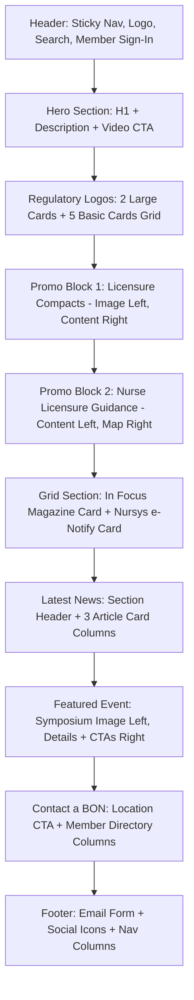

# NCSBN Homepage Layout Analysis Report

This document details the visual organization, DOM structure, container styling, image placements, and call-to-actions (CTAs) of the [National Council of State Boards of Nursing (NCSBN)](https://www.ncsbn.org/) homepage.

---

## 1. Structural Overview & Visual Hierarchy

The NCSBN homepage is structured vertically using a block-based design with full-bleed colored background sections containing centered content columns. The layout dynamically adjusts for responsiveness. In desktop view, the page content is wrapped within a fixed-width container aligned to the center.

### Core Layout Dimensions (Desktop View):
*   **Total Document Height**: ~7,480px
*   **Viewport Width (Maximized)**: 1,536px (CSS Pixels)
*   **Main Content Wrapper Width (`.pl-page-wrapper`)**: 1,264px centered (provides left/right margins of ~136px).



---

## 2. Visual Blocks & Section Hierarchy (Top to Bottom)

The page consists of 10 distinct horizontal blocks:

1.  **Header & Main Navigation**
    *   **Visual Box**: Fixed/sticky white header.
    *   **Height**: 156px.
    *   **Key Contents**: NCSBN Logo, Primary desktop navigation links, Member Sign In, and Search toggle.

2.  **Hero Section**
    *   **Visual Box**: Full-bleed background image with left-aligned overlay content box.
    *   **Height**: 474px.
    *   **Key Contents**: Primary heading (H1), short description, and video play button.

3.  **Regulatory Logos (Brand Grid)**
    *   **Visual Box**: Off-white/gray background grid containing brand cards.
    *   **Height**: 884px.
    *   **Key Contents**: Section heading, 2 large card links (NCLEX, Nursys) in a two-column row, and 5 small card links (NLC, APRN, JNR, ICRS, Atlas) in a five-column row.

4.  **First Promo Section: Licensure Compacts**
    *   **Visual Box**: Alternating block style. Dark/navy background with image on the left and content on the right.
    *   **Height**: 769.5px.
    *   **Key Contents**: Large graphics image, Category tag ("Licensure Compacts"), Heading ("Increasing Access to Care"), description, and standard blue CTA button.

5.  **Second Promo Section: Licensure**
    *   **Visual Box**: Alternating block style. Light/white background with content on the left and image on the right.
    *   **Height**: 769.5px.
    *   **Key Contents**: Category tag ("Licensure"), Heading ("Nurse Licensure Guidance"), description, standard blue CTA button, and large guidance map graphics image.

6.  **Magazines & Licensure Cards Grid**
    *   **Visual Box**: 2-column card grid section on a white background.
    *   **Height**: 891.8px.
    *   **Key Contents**: Left column: "In Focus" card with cover art and a "Subscribe to In Focus" CTA; Right column: "Nursys e-Notify" card with graphic and an "Access e-Notify" CTA.

7.  **Latest News Section**
    *   **Visual Box**: Large section with heading text, subtext, and a 3-column articles grid.
    *   **Height**: 1,106.9px.
    *   **Key Contents**: News section headers, "See All News" tertiary link, and 3 article news-cards containing images, titles, descriptions, and "Read More" links.

8.  **Featured Event Section**
    *   **Visual Box**: Dark navy section with image on the left and details on the right.
    *   **Height**: 767.6px.
    *   **Key Contents**: "Scientific Symposium" graphics image, H3 event title, horizontal row of event metadata (When, Where, Register By details with icons), "Register Now" button, and "View All Details" button.

9.  **Contact a Board of Nursing Section**
    *   **Visual Box**: Globe background graphic panel with centered content box and secondary side-by-side links.
    *   **Height**: 728.8px.
    *   **Key Contents**: Heading, description, "Select Your Location" CTA button, and 2 columns for "Associate Member" and "Exam User Member" links.

10. **Footer Section**
    *   **Visual Box**: Dark navy background divided into a newsletter callout block, a logo/social column, 4 columns of category links, and bottom utility copyright links.
    *   **Height**: 898.5px.
    *   **Key Contents**: Email signup CTA, social follow icons (X, FB, IG, LinkedIn, YT, Vimeo), detailed category maps, members area buttons, and copyright texts.

---

## 3. DOM Layout & Container Structures

### Navigation Header
```html
<header class="nav-sticky-wrapper js-nav-sticky-wrapper">
  <div class="nav-sticky-wrapper--flex-wrapper">
    <div class="nav-sticky-wrapper--flex ncsbn-grid">
      <!-- Logo Container -->
      <a class="nav-sticky-wrapper__link--logo ncsbn-grid__col-3" href="/index.page">
        
      </a>
      <!-- Desktop Navigation Menu -->
      <nav class="site-nav-desktop hidden-mobile js-nav-main">
        <a class="site-nav-desktop__link js-nav-tabbable" href="/exams.page">Exams</a>
        <a class="site-nav-desktop__link js-nav-tabbable" href="/nursing-regulation.page">Nursing Regulation</a>
        <a class="site-nav-desktop__link js-nav-tabbable" href="/compacts.page">Compacts</a>
        ...
      </nav>
      <!-- Search Trigger -->
      <button class="site-nav-desktop__dropdown-toggle js-nav-toggle">Search</button>
    </div>
  </div>
</header>
```

### Hero Section
*   **CSS Layout**: Container `home-hero` uses `display: flex` and `flex-direction: column`. The image uses absolute positioning/full-bleed styling (`object-fit: cover`) to span the section's background.
*   **Overlay**: `.home-hero__content` uses centered layout properties to position elements vertically.

### Card & Promo Sections
*   **Large Cards Container**: `.regulatory-logos-section--large-cards` uses a flexbox wrapper to distribute two `.logo-card__link--large` links evenly (each 632px wide).
*   **Small Cards Row**: `.regulatory-logos-section--basic-cards` positions five `.logo-card__link--basic` columns horizontally inside the 1264px container width.
*   **Promo Block Grid**: `.promo-section` uses a flexbox/block composition where `.promo-section__image` (660px) and `.promo-section__content` (700px) form two visual columns inside `.promo-section__inner.pl-page-wrapper`.
*   **Card Grid (`.obj-grid--two-up`)**: Utilizes columns of width ~592px side-by-side with padding.

---

## 4. Specific Image Placements

| # | Image / Brand | Source Path | Alt Text | Width | Height | Visual Coordinates (Top/Left) | Containing Block |
|---|---|---|---|---|---|---|---|
| 1 | NCSBN Branding | `/images/ncsbn.svg` | *None (Logo)* | 187px | 48px | Top: 75px, Left: 136px | `.nav-sticky-wrapper__link--logo` |
| 2 | Hero Background | `/images/ncsbn/Home-Hero-Lg.jpg` | *None* | 1536px | 474px | Top: 156px, Left: 0px | `.home-hero` |
| 3 | NCLEX Logo | `/images/ncsbn/nclex-logo.svg` | "NCLEX" | 183px | 40px | Top: 988px, Left: 177px | `.logo-card__image-container` |
| 4 | Nursys Logo | `/images/ncsbn/nursys-logo.svg` | "Nursys" | 183px | 50px | Top: 983px, Left: 825px | `.logo-card__image-container` |
| 5 | NLC Logo | `/images/ncsbn/nlc-logo.svg` | "Nurse Licensure Compact (NLC)" | 162px | 36px | Top: 1237px, Left: 169px | `.logo-card__image-container` |
| 6 | APRN Logo | `/images/ncsbn/aprn-logo.svg` | "APRN Compact" | 129px | 51px | Top: 1230px, Left: 444px | `.logo-card__image-container` |
| 7 | JNR Logo | `/images/ncsbn/journal-of-nursing-regulation-logo.svg` | "Journal of Nursing Regulation..." | 148px | 69px | Top: 1221px, Left: 694px | `.logo-card__image-container` |
| 8 | ICRS Logo | `/images/ncsbn/icrs-logo.svg` | "International Center..." | 160px | 59px | Top: 1226px, Left: 947px | `.logo-card__image-container` |
| 9 | Atlas Logo | `/images/ncsbn/atlas-logo.svg` | "Global Regulatory Atlas" | 114px | 75px | Top: 1218px, Left: 1229px | `.logo-card__image-container` |
| 10 | NLC Graphic | `/images/ncsbn/HomePromoImages--NLC-800x700-v4.png` | *None* | 660px | 578px | Top: 1610px, Left: 136px | `.promo-section__inner` |
| 11 | Licensure Map | `/images/ncsbn/HomePromoImages-NLG-800x700-v1.png` | *None* | 660px | 578px | Top: 2380px, Left: 740px | `.promo-section__inner` |
| 12 | In Focus Cover | `/images/ncsbn/Home-InFocus-275x200-v3.png` | "In Focus" | 592px | 431px | Top: 3149px, Left: 160px | `.labeled-card__image-container` |
| 13 | Nursys e-Notify | `/images/ncsbn/Nursysenotify-275x200-v2.png` | "Nursys" | 592px | 431px | Top: 3149px, Left: 784px | `.labeled-card__image-container` |
| 14 | Tri-Council News | `/images/tricouncil-newsrelease-720x480-3.png` | *None* | 395px | 263px | Top: 4317px, Left: 136px | `.news-card__image-container` |
| 15 | JNR SUD News | `/images/JNR-sud-newsrelease-promo8.png` | *None* | 395px | 263px | Top: 4317px, Left: 571px | `.news-card__image-container` |
| 16 | Workforce News | `/images/2026-workforce-news.png` | *None* | 395px | 263px | Top: 4317px, Left: 1005px | `.news-card__image-container` |
| 17 | Scientific Symp | `/images/events/26SciSymp-webpromo_square.png` | *None* | 500px | 500px | Top: 5214px, Left: 136px | `.featured-event-section__image` |
| 18 | White Footer Logo | `/images/ncsbn/ncsbn-white.svg` | "NCSBN" | 189px | 44px | Top: 7043px, Left: 136px | `.footer__logo` |

---

## 5. Main Navigation and Call-To-Actions (CTAs)

### Main Navigation Links (Desktop Header):
1.  **Exams**: `/exams.page`
2.  **Nursing Regulation**: `/nursing-regulation.page`
3.  **Compacts**: `/compacts.page`
4.  **Policy**: `/policy.page`
5.  **Research**: `/research.page`
6.  **Membership**: `/membership.page`
7.  **About**: `/about.page`

### Key Call-to-Actions (CTAs):
*   **Hero CTA**: "At This Very Moment" (Opens video modal dialog).
*   **Licensure Compacts Section**: "More About Compacts" (Standard blue button: `/compacts.page`).
*   **Nurse Licensure Guidance Section**: "Get Started" (Standard blue button: `/nursing-regulation/licensure/nurse-licensure-guidance.page`).
*   **In Focus Magazine**: "Subscribe to In Focus" (Outline button: `/about/subscribe.page`).
*   **Nursys e-Notify**: "Access e-Notify" (Outline button: `https://www.nursys.com/EN/ENDefault.aspx`).
*   **Latest News**: "See All News" (Blue text link: `/about/news/all-news.page`).
*   **Featured Event**: "Register Now" (Microsite redirection button) & "View All Details" (`/events/2026-ncsbn-scientific-symposium`).
*   **Contact BON**: "Select Your Location" (Outline button: `/membership/us-members/contact-bon.page`).
*   **Newsletter Sign Up**: "Subscribe to our Email List" (Standard blue button: `/about/subscribe.page`).
