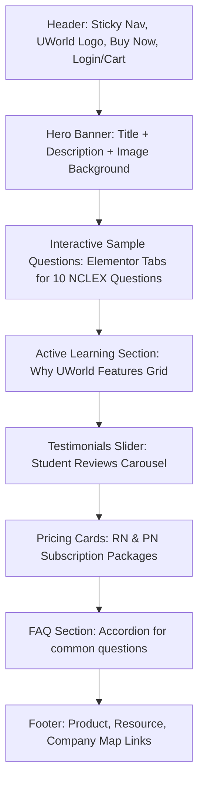

# UWorld Free NCLEX Practice Questions Layout Analysis Report

This document details the visual organization, DOM structure, container styling, image placements, and call-to-actions (CTAs) of the [UWorld Nursing - Free NCLEX Practice Questions](https://nursing.uworld.com/nclex/free-nclex-exam-practice-questions/) page.

---

## 1. Structural Overview & Visual Hierarchy

The UWorld Free NCLEX Questions page is built on WordPress using the **Astra Theme** and **Elementor Pro** page builder. The visual style relies on distinct full-width background stripes containing centered content blocks with a grid-based alignment. 

### Core Layout Dimensions (Desktop View):
*   **Default Viewport Width**: 1,536px (CSS Pixels)
*   **Max Content Width (Boxed Containers)**: 1,140px centered (standard Elementor variable `--container-max-width: 1140px` provides margins of ~198px on both sides).
*   **Layout Engine**: Flexbox containers (`.e-con`, `.e-flex`, `.e-con-boxed`, `.e-con-full`).



---

## 2. Visual Blocks & Section Hierarchy (Top to Bottom)

The page consists of 8 distinct visual segments:

1.  **Header & Mega-Navigation**
    *   **Visual Box**: Sticky white header that collapses/hides elements smoothly on scroll.
    *   **Main Contents**: UWorld Nursing Logo (left-aligned), primary dropdown menus (`PRODUCTS`, `OUR DIFFERENCE`, `RESOURCES`, `EDUCATORS`), and action links (`Buy Now` button dropdown, help icon, login icon, cart icon).

2.  **Hero Banner Section**
    *   **Visual Box**: Dark blue overlay with a centered text column, styled with a background image showing a student practicing questions on a laptop.
    *   **Key Contents**: Primary title (H1) "Practice with Free NCLEX®-Style Sample Questions", brief description, and navigational breadcrumbs.

3.  **Interactive Sample Questions Widget (Main Content)**
    *   **Visual Box**: Large centered light-blue container (`#page`) enclosing an interactive Elementor tabs widget.
    *   **Key Contents**: 
        *   **Tabs Header**: Row of circular numeric tabs (1 through 10) representing the sample questions.
        *   **Tab Panel**: Renders a question card containing the question text, response types (radio lists for multiple choice, checkboxes for "Select all that apply", or numerical inputs for dosage calculations), a "Submit" button, and an expandable "Explanation" block.
        *   **Explanation Block**: Displays the correct answer, rich clinical explanation text, high-resolution anatomy/pathology diagrams, educational summaries, and "Previous/Next" navigation buttons.

4.  **Active Learning Features**
    *   **Visual Box**: Off-white layout block presenting a grid of core product capabilities.
    *   **Key Contents**: Descriptive cards highlighting UWorld’s active learning philosophy (Visual Rationales, QBank Interface, Performance Metrics, and Study Plans).

5.  **Student Testimonials (Reviews)**
    *   **Visual Box**: A carousel slide section with centered testimonials.
    *   **Key Contents**: Student quotes, names, pass-rates, and visual star ratings.

6.  **Subscription Pricing Section (`#flexible-pricing`)**
    *   **Visual Box**: A grid containing the main pricing cards for NCLEX-RN and NCLEX-PN review plans.
    *   **Key Contents**: Subscription terms, features checklist (e.g., QBank access, Self-Assessments, AI Tutor), prices, and yellow "Buy Now" CTA buttons.

7.  **FAQ Accordion Section (`#faq`)**
    *   **Visual Box**: Centered layout container holding an expandable accordion interface.
    *   **Key Contents**: Pre-set accordion panels answering common student queries about the NCLEX format, pass rules, and UWorld features.

8.  **Footer Area**
    *   **Visual Box**: Dark gray background split into standard category map navigation links, social media icons, and a copyright bar at the bottom.

---

## 3. DOM Layout & Container Structures

### Sticky Header Wrapper
```html
<header id="masthead" class="site-header header-main-layout-1 ast-primary-menu-enabled ast-logo-title-inline ast-hide-custom-menu-mobile ast-builder-menu-toggle-icon ast-mobile-header-inline">
  <div id="ast-desktop-header">
    <div class="ast-main-header-wrap main-header-bar-wrap">
      <div class="ast-primary-header-bar ast-primary-header main-header-bar ast-container">
        <!-- Brand Logo -->
        <span class="site-logo-img">
          <a class="custom-logo-link" href="https://nursing.uworld.com/">
            
          </a>
        </span>
        <!-- Navigation Menu -->
        <nav id="primary-site-navigation-desktop" class="site-navigation">
          <ul id="ast-hf-menu-1" class="main-header-menu ast-nav-menu ast-flex ast-mega-menu-enabled">
            <li class="menu-item menu-item-has-children astra-megamenu-li"><a class="menu-link">PRODUCTS</a></li>
            <li class="menu-item menu-item-has-children astra-megamenu-li"><a class="menu-link">OUR DIFFERENCE</a></li>
            <li class="menu-item menu-item-has-children astra-megamenu-li"><a class="menu-link">RESOURCES</a></li>
            <li class="menu-item menu-item-has-children astra-megamenu-li"><a class="menu-link">EDUCATORS</a></li>
          </ul>
        </nav>
      </div>
    </div>
  </div>
</header>
```

### Sample Question Tab Content Box
```html
<div id="e-n-tab-content-xxxx" class="elementor-element e-con-full e-flex e-con e-child" role="tabpanel">
  <div class="elementor-widget-container">
    <p class="passage-text"><strong>Question</strong></p>
    <p class="no-margin-bottom default-color">Question Prompt Text...</p>
    
    <div class="explanation-container">
      <table class="answer-table custom-image-table">
        <!-- Radio/Checkbox Option Row -->
        <tr>
          <td><input type="radio" name="answer" value="A"></td>
          <td class="formula-td"><span>1.</span> Option text...</td>
        </tr>
      </table>
      
      <button class="submit-btn">Submit</button>
      
      <!-- Hidden until submitted -->
      <div class="explanation-text" style="display: none;">
        <hr class="hrblock">
        <p class="passage-exp-text1"><strong>Explanation</strong></p>
        <p class="text-center"></p>
        <p>Detailed explanation paragraph...</p>
        <div class="next-prev-buttons">
          <button class="prev-btn">Previous</button>
          <button class="next-btn">Next</button>
        </div>
      </div>
    </div>
  </div>
</div>
```

---

## 4. Specific Image Placements

| # | Image / Brand | Source Path | Alt Text | Width | Height | Context / Block |
|---|---|---|---|---|---|---|
| 1 | UWorld Nursing Logo | `/wp-content/uploads/2023/11/UWorld-Nursing-Logo-Primary@2x-300x46-2.png` | "UWorld Nursing" | 561px | 86px | Main Header (Desktop) |
| 2 | Hero Background Image | `/wp-content/uploads/2023/05/Nursing_NCLEX-Sample-Questions_Hero.webp` | "Student practicing with UWorld Nursing’s NCLEX..." | 1440px | 960px | `.entry-header` / Page Hero Background |
| 3 | Compartment Syndrome | `/wp-content/uploads/2023/05/L21126-scaled.webp` | "Compartment syndrome" | 2560px | 1551px | Question 1 Explanation Rationale |
| 4 | Chronic Constipation | `/wp-content/uploads/2023/05/L19599.webp` | "UWorld nclex sample questions - chronic constipation" | 700px | 444px | Question 2 Explanation Rationale |
| 5 | Deep Venous Thrombosis | `/wp-content/uploads/2026/03/L20714.webp` | "Deep venous thrombosis (DVT)" | 1400px | 1400px | Question 3 Explanation Rationale |
| 6 | Pericarditis Diagram | `/wp-content/uploads/2026/03/L20860.webp` | "Pericarditis" | 1400px | 1200px | Question 4 Explanation Rationale |
| 7 | Peritoneal Dialysis | `/wp-content/uploads/2026/03/L25368.webp` | "peritoneal dialysis (PD)" | 1400px | 1296px | Question 5 Explanation Rationale |
| 8 | Favicon Icon | `/wp-content/uploads/2021/09/favicon-1.ico` | *None* | 32px | 32px | Webpage Header Metadata |

---

## 5. Main Navigation and Call-To-Actions (CTAs)

### Action Menu Header CTAs:
*   **Buy Now Button**: Yellow rounded outline CTA trigger (`.free-trial-menu-button`).
*   **Login Trigger**: User profile icon redirection link (`https://www.uworld.com/app/index.html#/login/`).
*   **Cart Trigger**: Shopping bag icon redirection link (`https://www.uworld.com/app/index.html#/payment/cart`).

### Page Body Call-to-Actions (CTAs):
*   **Question Submit**: "Submit" (Red rounded button: `.submit-btn` triggers JS evaluation and shows rationale block).
*   **Question Navigation**: "Previous" / "Next" (Peach color background button: `.prev-btn` & `.next-btn` triggers tab slide change).
*   **Pricing CTAs**: "Buy Now" (Yellow/blue buttons under pricing cards directing users to their checkout/cart page).
*   **Information Links**: In-line links embedded in descriptions pointing to related NCLEX resources (e.g., `/dosage-calculation-practice-questions/`, `/nclex/passing-score-and-scoring-guide/`).
