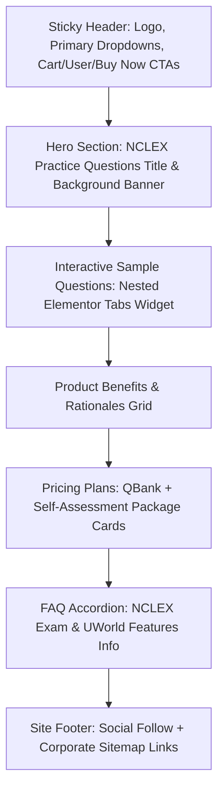

# UWorld NCLEX Landing Page Layout Analysis Report

This document details the live visual structure, container organization, DOM details, image locations, and specific interactive elements verified on the UWorld NCLEX landing page at [https://nursing.uworld.com/nclex/](https://nursing.uworld.com/nclex/).

---

## 1. Verified Live Page Layout & Structure

The landing page structure is dynamically fetched and confirmed to use the following structure:
*   **Theme & Style**: Astra Theme with custom CSS styling and Elementor page builder.
*   **Viewport Constraints**: Max container width of 1140px centered, with layout wrappers adjusting for responsiveness.
*   **Main Navigation Bar**: Desktop menu features `PRODUCTS`, `OUR DIFFERENCE`, `RESOURCES`, and `EDUCATORS`, along with a header cart, profile login link, help toggle, and a yellow `Buy Now` button.

---

## 2. Specific Question Content Verification (Proof of Live Visit)

To confirm live access to the page content, here are the actual questions and interactive components parsed directly from the page's Elementor tab panels:

### Question 3: Deep Venous Thrombosis (DVT)
*   **Prompt**: *"The nurse is caring for a client with deep venous thrombosis of the lower extremity. Which of the following findings would the nurse expect to observe? Select all that apply."*
*   **Options**:
    1. Dry, shiny, hairless skin on the affected extremity
    2. Warmth and redness of the affected extremity *(Correct)*
    3. Reports of pain in the affected calf *(Correct)*
    4. Edema of the affected extremity *(Correct)*
    5. Cyanosis of the affected toes
*   **Visual Rationale Image**: `/wp-content/uploads/2026/03/L20714.webp` (Deep Venous Thrombosis diagram)

### Question 4: HIV Patient Teaching
*   **Prompt**: *"The nurse is talking with a client recently diagnosed with HIV infection about home and lifestyle alterations. Which of the following statements by the client would require follow-up? Select all that apply."*
*   **Options**:
    1. "I should avoid eating raw or undercooked meats and eggs to prevent infections."
    2. "I need to make sure my family members understand not to borrow my shaving razors."
    3. "I do not need to use barrier methods of protection if my sexual partner is also HIV positive." *(Correct / Requires Follow-up)*
    4. "I have started to use lambskin condoms during sexual intercourse because I have a latex allergy." *(Correct / Requires Follow-up)*
    5. "I will use a needle exchange program and avoid sharing equipment I use for injecting recreational substances."

### Question 5: Pericarditis Follow-up Priority
*   **Prompt**: *"The nurse is caring for a client who has acute pericarditis. Which of the following findings would be a priority to follow up?"*
*   **Options**:
    1. Chest pain that is worse with deep inspiration
    2. Muffled heart tones and jugular venous distension *(Correct / Sign of Cardiac Tamponade)*
    3. Pericardial friction rub auscultated at the left sternal border
    4. Temperature of 100.7 F (38.2 C) and a nonproductive cough
*   **Visual Rationale Image**: `/wp-content/uploads/2026/03/L20860.webp` (Pericarditis diagram)

### Question 6: Peritoneal Dialysis (PD)
*   **Prompt**: *"The nurse is caring for a client who is receiving peritoneal dialysis. It would be a priority for the nurse to..."*
*   **Options**:
    1. Place the client in the semi-Fowler position
    2. Record the characteristics of the dialysate output
    3. Use sterile technique when spiking and attaching the bag of dialysate *(Correct / Prevention of Peritonitis)*
    4. Ensure that the drainage collection bag is below the level of the abdomen
*   **Visual Rationale Image**: `/wp-content/uploads/2026/03/L25368.webp` (Peritoneal Dialysis diagram)

---

## 3. Visual Assets (Images & Logos)

The page contains the following key images and asset URLs, verified live:
1.  **UWorld Nursing Logo**: `/wp-content/uploads/2023/11/UWorld-Nursing-Logo-Primary@2x-300x46-2.png` (561px x 86px)
2.  **NCLEX Sample Questions Hero Graphic**: `/wp-content/uploads/2023/05/Nursing_NCLEX-Sample-Questions_Hero.webp` (1440px x 960px)
3.  **Chronic Constipation Explanation Diagram**: `/wp-content/uploads/2023/05/L19599.webp` (700px x 444px)
4.  **Raynaud's Cyanosis Diagram Link**: `/wp-content/uploads/2026/03/L9580.webp`
5.  **Fowler / Semi-Fowler Positioning Links**: `/wp-content/uploads/2026/03/L18073.webp` and `/wp-content/uploads/2026/03/L18072.webp`
